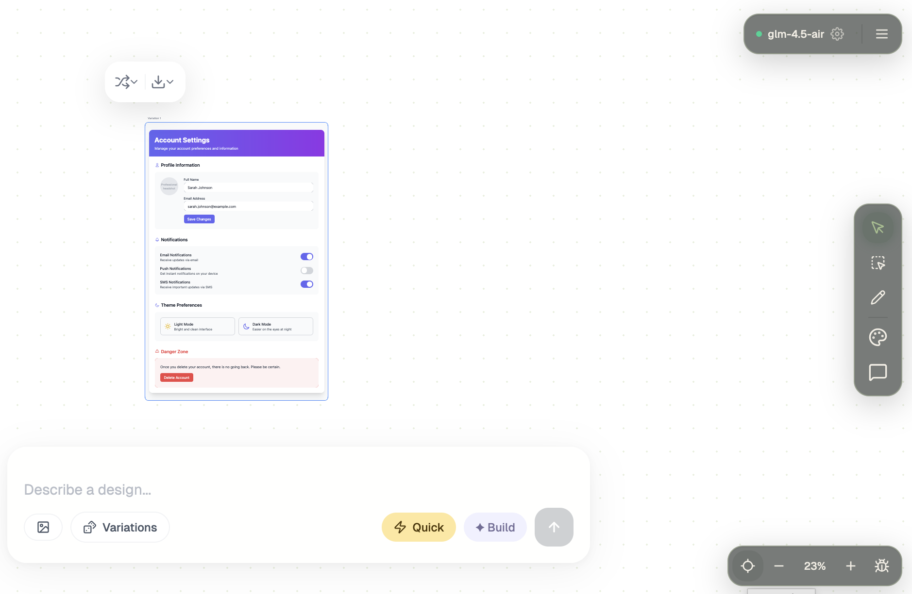

# Calca

An AI design tool that transforms natural language prompts into polished HTML/CSS variations on an infinite canvas.

**Design with words.**

 

## Features

- **Infinite Canvas** — Pan, zoom, and organize like Figma
- **AI Design Generation** — Describe a design, get polished HTML/CSS variations
- **Iterative Refinement** — Each concept learns from the last via sequential AI critique
- **Multi-Model Pipeline** — Claude for layout + QA, Gemini for images
- **Export** — Figma, Tailwind CSS, React components
- Cross-platform support: runs on  and 

## Contributing

Calca is open-source (see License info below).

If you're interested in contributing to Calca, please read our [contributing doc](CONTRIBUTING.md).

- [Ideas and Feedback](https://github.com/espetro/calca/discussions/5)
- [Roadmap](https://github.com/users/espetro/projects/6)

## Built With

[Vite](https://vitejs.dev) · [Turbo](https://turbo.build) · [Hono](https://hono.dev) · [TanStack Router](https://tanstack.com/router) · [AI SDK](https://sdk.vercel.ai)

## License

Core: [AGPL-3.0](LICENSE)
Pro: [Elastic License v2](packages/pro/LICENSE)

Based on DesignBuddy Canvas (MIT-licensed)
