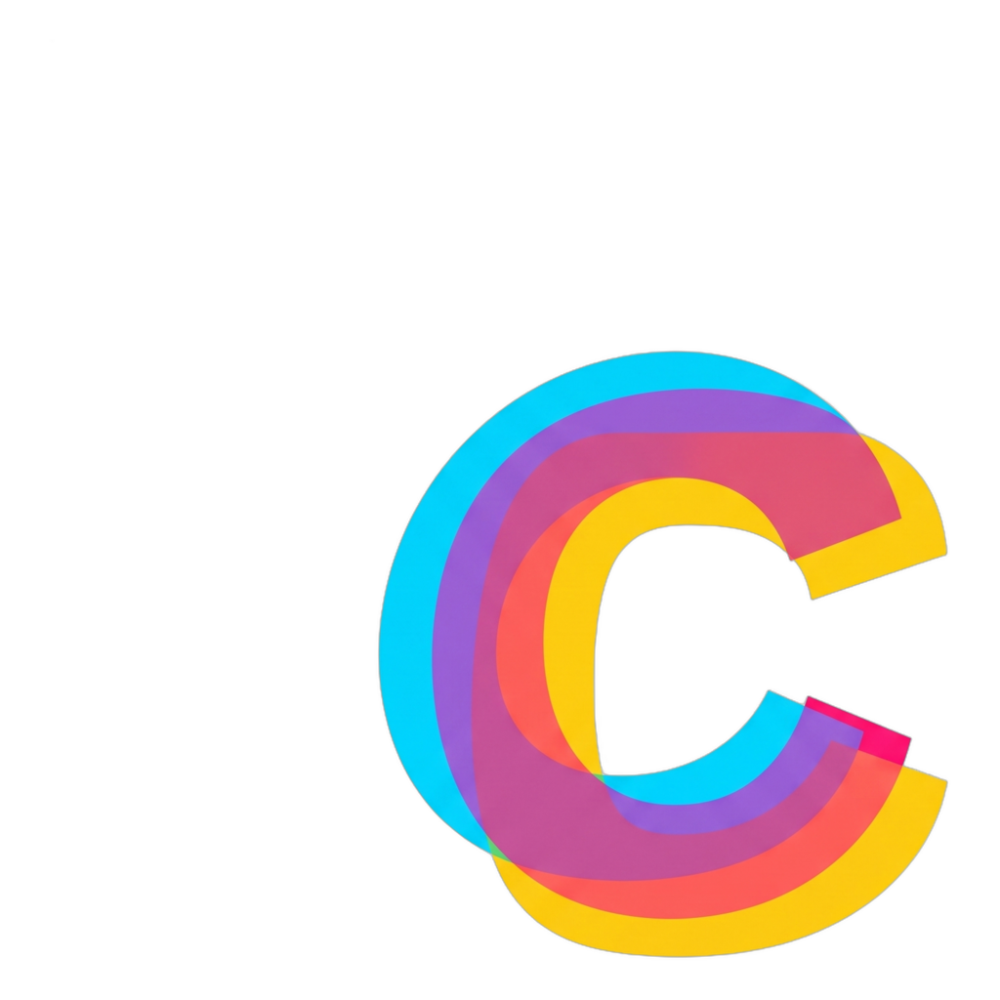

<div align="center">
  <a href="https://calca.illo.fyi">
    
  </a>

  <h1>calca</h1>

  <p>
    <strong>An open canvas for every format.</strong><br />
    Describe a page, a prototype, a brand board — get live variations as movable
    frames, then remix, export, or hand the board to your agent.<br />
    Open source · BYOK · Web + desktop
  </p>

  <p>
    <a href="https://calca.illo.fyi/app/?prompt=A%20landing%20page%20for%20a%20sourdough%20bakery%20%E2%80%94%20warm%20hero%20with%20a%20tagline%2C%20a%20three-item%20bread%20menu%20with%20prices%2C%20a%20short%20story%20section%2C%20and%20a%20footer%20with%20hours%20and%20address.&preset=marketing"><strong>Try the web demo »</strong></a>
    <br /><br />
    <a href="https://calca.illo.fyi/docs/">Docs</a> ·
    <a href="https://github.com/espetro/calca/releases/latest">Desktop app</a> ·
    <a href="https://github.com/users/espetro/projects/6">Roadmap</a> ·
    <a href="./CONTRIBUTING.md">Contributing</a>
  </p>

  <p>
    <a href="https://github.com/espetro/calca/actions/workflows/canvas.yml"></a>
    <a href="https://www.npmjs.com/package/@calca/mcp"></a>
    <a href="https://github.com/espetro/calca/releases/latest"></a>
    <a href="https://github.com/espetro/calca/stargazers"></a>
  </p>

  <a href="https://calca.illo.fyi/app/">
    
  </a>
</div>

## Packages

The canvas libraries and the agent playground are on npm — build a canvas app or plug an agent into a board:

| Package | What it gives you |
| --- | --- |
| [`@calca/canvas-base`](https://www.npmjs.com/package/@calca/canvas-base) | Zero-dependency document core: records, commands, undo history, versioned snapshots |
| [`@calca/canvas-ui`](https://www.npmjs.com/package/@calca/canvas-ui) | Headless React canvas components — frame chrome, overlays, marquee selection |
| [`@calca/canvas-flow`](https://www.npmjs.com/package/@calca/canvas-flow) | React Flow adapter: store → live canvas surface, user edits → commands |
| [`@calca/mcp-core`](https://www.npmjs.com/package/@calca/mcp-core) | Runtime-neutral MCP tool surface and contract for canvas sessions |
| [`@calca/mcp`](https://www.npmjs.com/package/@calca/mcp) | The `calca` CLI — stdio MCP server, board files, host installers |
| [`@calca/shared`](https://www.npmjs.com/package/@calca/shared) | Shared TypeScript types for the stack |

Point your agent at a board:

```bash
npx -y @calca/mcp mcp install claude-code   # also: cursor, codex
```

## Where to go next

- **Use the app** → [calca.illo.fyi/app](https://calca.illo.fyi/app/) · [quick start](https://calca.illo.fyi/docs/quickstart/) · [docs](https://calca.illo.fyi/docs/)
- **Hack on the repo** → [CONTRIBUTING.md](./CONTRIBUTING.md)
- **Ideas & feedback** → [discussions](https://github.com/espetro/calca/discussions/5) · [roadmap](https://github.com/users/espetro/projects/6)

---

Calca is open source — see [LICENSE](./LICENSE) and each package's `package.json` for terms.
