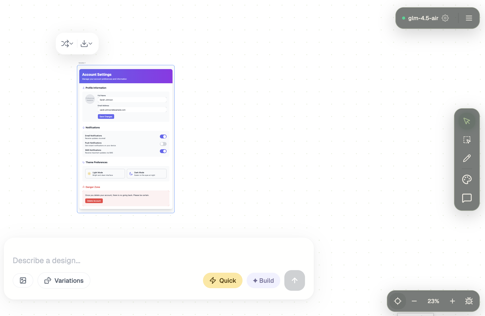

# Calca

An open, file-based, free-form AI canvas — design with words, on an infinite canvas, alongside agents.

**Design with words.**

## Three layers

Calca is being re-architected into three layers (tracking issue: [#37](https://github.com/espetro/calca/issues/37)):

| Layer                    | Goal                                                                                                                  | Packages                                                                                                                            | Licence    |
| ------------------------ | --------------------------------------------------------------------------------------------------------------------- | ----------------------------------------------------------------------------------------------------------------------------------- | ---------- |
| **1 — Canvas library**   | An open-source canvas comparable to tldraw, built on React Flow                                                       | `@calca/canvas-base` (RF-free primitives) · `@calca/canvas-ui` (headless UI components) · `@calca/canvas-flow` (React Flow adapter) | Apache-2.0 |
| **2 — Agent playground** | Tooling so a team and their agents can work on a canvas in near-real-time — Web-Standards-only CLI + MCP              | `@calca/mcp-core` · `@calca/mcp` (`calca` CLI) · `calca serve` relay                                                                | Apache-2.0 |
| **3 — Calca app**        | The free-form AI canvas app: fast iterations without token bloat or drift, driven by an in-browser BYOK agent harness | `@calca/agent-core` (Apache-2.0) · `@calca/app` (AGPL-3.0)                                                                          | AGPL-3.0   |

The libraries (Layers 1–2 plus `agent-core`) are Apache-2.0, the app is AGPL-3.0, and `packages/pro` stays under Elastic License v2.

## Repository map (today)

- `apps/web` — the Calca app: Vite SPA (React 19, TanStack Router), Feature-Sliced Design
- `apps/server` — Hono API server
- `apps/cli` — seed of the Layer 2 CLI/MCP playground
- `apps/landing` — Astro marketing site · `apps/feedback-proxy` — Cloudflare Worker for feedback
- `packages/canvas` (`@app/canvas`) — app-level canvas feature package on React Flow (steps toward Layer 1)
- `packages/agent-core` (`@calca/agent-core`) — browser-safe agent-harness seam over the AI SDK (BYOK)
- `packages/pipeline` (`@calca/pipeline`) — generation pipeline steps · `packages/core` — prompts, providers, domain logic
- `packages/shared` · `logger` · `analytics` · `config` · `pro`
- `platforms/desktop` — Electrobun shell (macOS + Windows)

## Features

- **Infinite Canvas** — Pan, zoom, and organize like Figma
- **AI Design Generation** — Describe a design, get polished HTML/CSS variations
- **Iterative Refinement** — Each concept learns from the last via sequential AI critique
- **Multi-Model Pipeline** — Claude for layout + QA, Gemini for images
- **BYOK** — Bring your own provider key; runs against local models (LM Studio) too
- **Export** — Figma, Tailwind CSS, React components
- Cross-platform support: runs on  and 

## Contributing

Calca is open-source (see License info below).

If you're interested in contributing to Calca, please read our [contributing doc](CONTRIBUTING.md).

- [Ideas and Feedback](https://github.com/espetro/calca/discussions/5)
- [Roadmap](https://github.com/users/espetro/projects/6)

## Built With

[Vite](https://vitejs.dev) · [Turbo](https://turbo.build) · [Hono](https://hono.dev) · [TanStack Router](https://tanstack.com/router) · [React Flow](https://reactflow.dev) · [AI SDK](https://sdk.vercel.ai) · [Electrobun](https://electrobun.dev)

## License

Libraries (`@calca/canvas-*`, `@calca/mcp*`, `@calca/agent-core`): Apache-2.0
App (`@calca/app`, `apps/`, other `packages/`): [AGPL-3.0](LICENSE)
Pro (`packages/pro`): [Elastic License v2](packages/pro/LICENSE)

Based on DesignBuddy Canvas (MIT-licensed)
