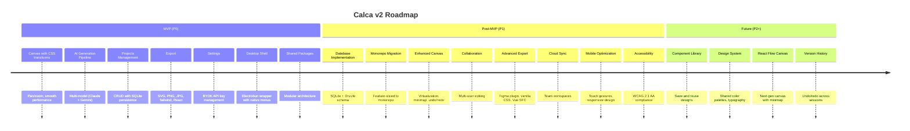

# Calca Roadmap

This directory contains feature roadmaps and implementation plans for Calca v2, organized by phase and priority.

## Overview

Calca v2 is a documentation-first, incremental refactoring of the working Calca 1.0 codebase. The MVP delivers a fully functional AI design tool with server-side persistence and desktop capabilities. Post-MVP features expand collaboration, storage, and export capabilities.

## Roadmap Phases

## Feature Documentation

| Feature | Priority | Description | Dependencies |
|---------|----------|-------------|--------------|
| [Database](./database.md) | P1 | SQLite + Drizzle persistence layer with schema and migrations | — |
| [Desktop](./desktop.md) | P0 | Electrobun desktop wrapper with native menus and hotkeys | — |
| [Monorepo Migration](./monorepo-migration.md) | P1 | Migrate from FSD `src/` structure to monorepo packages | — |
| [Canvas Enhancements](./canvas-enhancements.md) | P1/P2 | Virtualization, minimap, undo/redo for infinite canvas | — |
| [Post-MVP Features](./post-mvp-features.md) | P1/P2 | Collaboration, cloud sync, mobile optimization, accessibility | — |

## Priority Definitions

- **P0** — Critical for MVP. Blocker features.
- **P1** — High priority. Post-MVP expansion.
- **P2** — Low priority. Nice-to-have enhancements.

## Implementation Phases

### Phase 1: Foundation (Week 1)
- Set up Bun workspace monorepo structure
- Create shared packages (types, contracts, schemas)
- Extract AI logic to `packages/core` (prompts, parsers, providers)
- Initialize SQLite + Drizzle ORM with schema
- Write basic API routes using shared packages

### Phase 2: Frontend Refactor (Week 2)
- Refactor canvas state to custom hooks and context providers
- Extract components from `page.tsx` to separate files
- Implement settings UI with server-side API integration
- Add desktop shell (Electrobun) wrapper
- Test canvas performance with 50+ frames

### Phase 3: Backend Integration (Week 3)
- Implement database queries and migrations
- Add error handling and retry logic to API routes
- Implement project CRUD operations
- Add export functionality
- Test end-to-end generation flow

### Phase 4: Desktop Shell (Week 4)
- Implement window chrome and native menus
- Add desktop-specific hotkeys
- Implement system tray integration
- Test auto-update check
- Optimize startup time and memory footprint

### Phase 5: Testing & Polish (Week 5)
- Manual testing of all MVP features
- Performance optimization (virtualization, caching)
- Error handling improvements
- Documentation updates
- Prepare for initial release

## References

- **PRD v2**: `docs/prd-v2.md` — Complete feature requirements
- **POC Learnings**: `docs/poc-learnings.md` — Carry/Skip/Redesign verdicts
- **MADRs**: `docs/decisions/` — Technology decision documents
- **Architecture**: `docs/architecture-plan.md` — Detailed architecture decisions
- **AGENTS.md** — Monorepo structure and conventions
